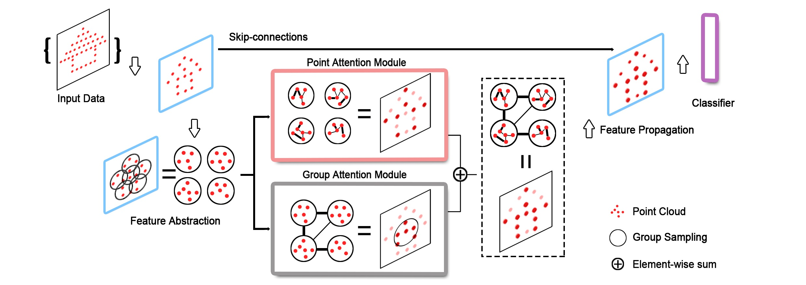

# DAPnet: A Double Self-attention Convolutional Network for Point Cloud Semantic Labeling

Airborne Laser Scanning (ALS) point clouds have complex structures and the 3D semantic labeling of them is a challenging task. It has three problems (1) the difficulty of classifying point clouds in adjacent areas, (2) the diversity of shapes of the same classes, and (3) the scale differences between classes. In this study, we propose a novel double self-attention convolutional neural network, called DAPnet. The double self-attention module originates from the self-attention mechanism, including the point attention module (PAM) and group attention module (GAM). The PAM can effectively classify the points by assigning different weights based on the relevance of point clouds in adjacent areas. Meanwhile, the GAM enhances the correlation between groups, i.e., points between the same classes, which reduces the effect of different shapes. To solve the scaling problem, we adopt multiscale radius to construct the group and concatenate the extracted hierarchical features with the outputs of the corresponding upsampling process. In the experiments, DAPNet performs well in several semantic labeling contests. By conducting ablation comparisons, we find that the PAM is more effective for the overall improvement of the model than the GAM, and the incorporation of the double self-attention module has an average of 7\% improvement on the pre-class accuracy of the classes. And DAPnet consumes a similar training time as the one without the attention module for model convergence. The experimental result shows the effectiveness and efficiency of DAPnet for the semantic labeling of ALS point clouds.